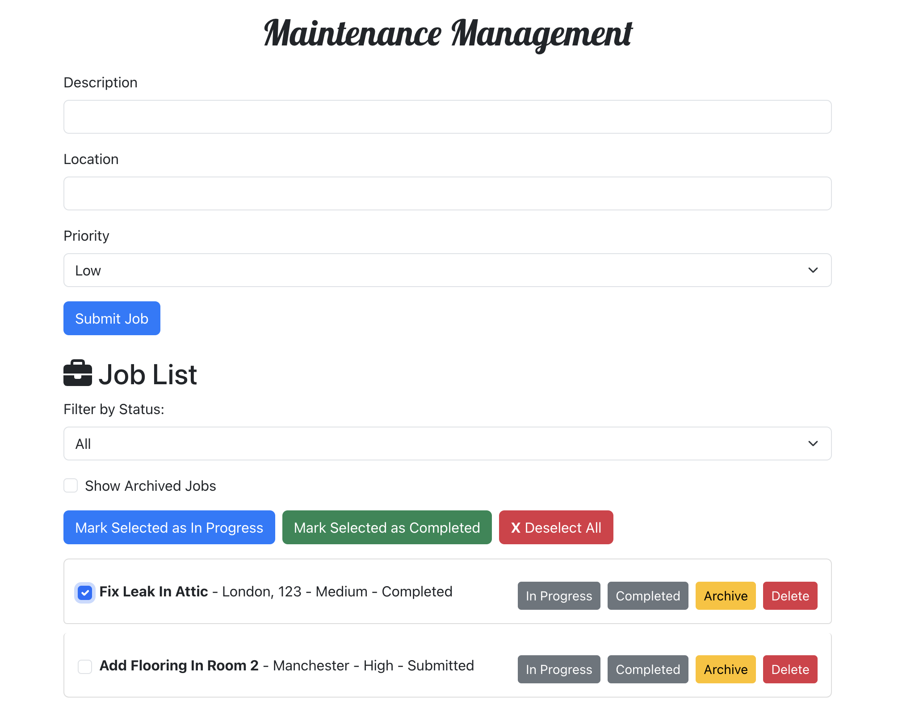

# Maintenance Management Application



## Table of Contents

- [Description](#description)
- [Project Structure](#project-structure)
- [Features](#features)
- [Technologies Used](#technologies-used)
- [Prerequisites](#prerequisites)
- [Installation](#installation)
- [Launching the App](#launching-the-app)
- [API Endpoints](#api-endpoints)
- [Usage](#usage)
- [Testing](#testing)
- [Components](#components)
- [Creator](#creator)

## Description

## Description

The Maintenance Management Application is a comprehensive full-stack web application designed to streamline the management of maintenance tasks within an organization. The application allows users to efficiently submit, track, and update maintenance jobs with various attributes such as descriptions, locations, and priorities.

### Key Features:

- **CRUD Operations**: Users can perform Create, Read, Update, and Delete (CRUD) operations on maintenance jobs, ensuring that tasks are always up-to-date and accurately reflected in the system.
- **Batch Status Updates**: The application supports batch updates, allowing multiple jobs to be updated to a new status simultaneously, saving time and reducing the potential for errors.
- **Job Archiving**: Completed or obsolete jobs can be archived, helping to keep the active job list clean and focused on current tasks.
- **Status Filtering**: Users can filter jobs by their status (e.g., Submitted, In Progress, Completed), making it easier to manage and review tasks based on their current state.
- **Toast Notifications**:

• toast.success("Job added successfully!"): Notifies the user when a job is added.

• toast.info("Job updated successfully!"): Notifies the user when a job is updated.

- **ToastContainer**: Added <ToastContainer /> to render and manage toast notifications.

- I Ensured the project has the package react-toastify installed by inputting into the terminal in the client side:

```bash
npm install react-toastify
```

### Technical Details:

- **Mongoose Integration**: The application utilizes Mongoose to connect to a MongoDB database, allowing for seamless data storage and retrieval. Mongoose models are used to define the structure of the job documents in the database, ensuring data integrity and consistency.
- **Database Connectivity**: The backend is connected to a MongoDB Atlas cluster, enabling secure and scalable data management. All job-related data is stored in this database, making it accessible from anywhere and ensuring reliability.

## Project Structure

```bash
├── backend
│   ├── controllers
│   │   └── jobController.js
│   ├── models
│   │   └── job.js
│   ├── app.js
│   ├── .gitignore
│   └── README.md
├── frontend
│   ├── src
│   │   ├── components
│   │   │   ├── JobForm.js
│   │   │   ├── JobList.js
│   │   ├── services
│   │   │   └── api.js
│   │   ├── tests
│   │   │   ├── JobForm.test.js
│   │   │   ├── JobList.test.js
│   ├── public
│   ├── .gitignore
│   └── README.md
├── .gitignore
├── package.json
└── README.md
```

## Features

- **Job Management:**: Create, update, delete, and archive maintenance jobs.
- **Filtering**: Filter jobs by status and archived status.
- **Batch Updates**: Update the status of multiple jobs at once.
- **Security**: Helmet, cors and express-validator is used to enhance application security.

## Technologies Used

- **Frontend**:
- React.js
- Bootstrap for UI components
- Jest for testing

- **Backend**:
- Node.js with Express.js for the server
- MongoDB with Mongoose for the database
- Helmet for security
- Cors for cross-origin resource sharing
- Postman for testing

## Prerequisites

Before you begin, ensure you have the following installed on your system:

- [Node.js](https://nodejs.org/) (version 14.x or later)
- [MongoDB] Atlas account (or a local MongoDB instance)
- [npm](https://www.npmjs.com/) (version 6.x or later)
- [Git](https://git-scm.com/)
- A `.env` file set up in the `server` directory.

### Setting Up the .env File

Create a `.env` file to store your MongoDB connection string inside of the server directory where the `app.js` file is located.

```bash
MONGO_URI=mongodb+srv://<username>:<password>@cluster.mongodb.net/maintenance
```

Then install the `dotenv` package to help load environment variables from `.env` files:

```bash
npm install dotenv
```

## Installation

To install and run the application locally:

### Setup Instructions

1. Clone the repository:

   ```bash
   git clone https://github.com/M311HAN/maintenance-management.git
   ```

2. Navigate to the project directory:

   ```bash
   cd maintenance-management
   ```

3. Install the dependencies:

   ```bash
   # Install server-side dependencies
   cd server
   npm install
   ```

4. ```bash
   # Install client-side dependencies
   cd client
   npm install
   ```
5. Create a `.env` file to store your MongoDB connection string:

```bash
MONGO_URI=mongodb+srv://<username>:<password>@cluster.mongodb.net/maintenance
```

### Launching the App

### Running the Backend Server

1. Navigate to the server directory:

   ```bash
   cd server
   ```

2. Start the server-side with nodemon:
   ```bash
   npm run dev
   ```

The server should now be running on `http://localhost:8080`.

### Running the Frontend

1. Navigate to the client directory:

   ```bash
   cd client
   ```

2. Start the React app:
   ```bash
   npm start
   ```

The frontend should now be running on `http://localhost:3000`.

## API Endpoints

- `POST /api/jobs:` Create a new job.

- `GET /api/jobs:` Get all jobs, optionally filtered by archived status.

- `PUT /api/jobs/:` Update a specific job's status or other details.

- `PUT /api/jobs/status:` Batch update the status of multiple jobs.

- `PUT /api/jobs/archive/:` Archive a specific job.

- `DELETE /api/jobs/:` Delete a specific job.

## Usage

- `Creating a Job:` Fill out the job form with a description, location, and priority, and submit it.

- `Updating a Job:` Use the "In Progress" and "Completed" buttons in the job list to update the status.

- `Batch Updating:` Select multiple jobs and update their status in bulk.

- `Archiving a Job:` Use the "Archive" button to archive completed jobs.

- `Filtering Jobs:` Use the dropdown and checkbox to filter jobs by status and archived status.

# Testing

To run the tests, navigate to the respective directory and use the following command:

```bash
npm test
```

This will run the Jest test suites for both the frontend and backend.

## Components

### Frontend

- **JobForm.js**: Handles job creation, including form validation and submission.
- **JobList.js**: Displays and manages the list of jobs, including filtering, status updates, archiving, and deletion.
- **api.js**: Manages API requests to the backend, handling CRUD operations for jobs.
- **app.js**: The entry point of the frontend application, responsible for rendering components and managing routes.

### Backend

- **jobController.js**: Contains the controller functions that handle the business logic for creating, updating, retrieving, archiving, and deleting jobs. It also includes validation logic using `express-validator`.
- **job.js**: Defines the Mongoose schema and model for a job, specifying fields like description, location, priority, status, and archived status.
- **app.js**: The entry point of the backend application, responsible for setting up middleware (Helmet, CORS, body-parser), connecting to MongoDB, and defining API routes for job management.

## Creator

This project is created by Melihhan (https://github.com/M311HAN). [Visit the repository](https://github.com/M311HAN?tab=repositories) for more projects and further collaboration.

